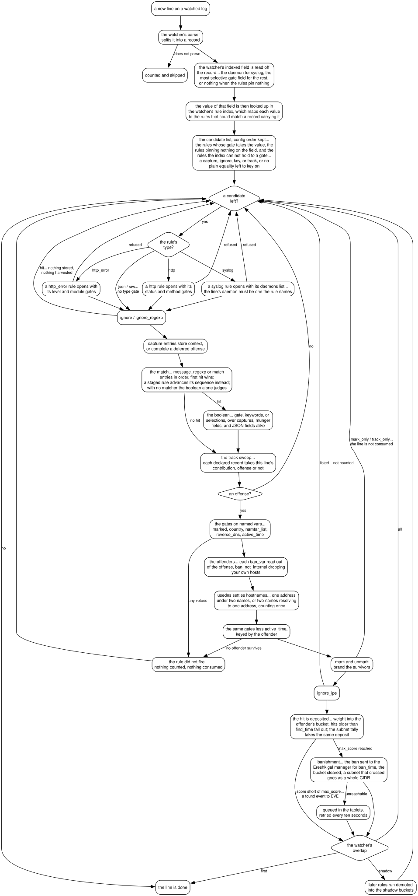

# Architecture

## The pair

Baphomet and [Ereshkigal](https://github.com/LilithSec/Ereshkigal) split
the fail2ban job in two...

- **Ereshkigal** rules Kur. It owns the firewalls, holds the state of who
  is banished where, times sentences, and releases the served. Its manager
  listens on `/var/run/ereshkigal/socket` speaking newline delimited JSON.
- **Baphomet** is the accuser. It reads logs, decides which IPs have
  offended enough, and delivers them to that socket. It never touches a
  firewall itself.

The two meet at the kur names. A `[kur.sshd]` in Baphomet's config sends
its bans targeted at the kur named `sshd` on the Ereshkigal side, so the
names should line up across the two configs. The target over there may be
a real kur or a gate... a `fan_out` kur with no firewall of its own that
relays each banishment to its members, letting one galla feed a whole
set of kurs through a single name.

## The processes

```
baphomet (manager)
├── galla sshd     one worker per [kur.*] in the config
├── galla nginx
└── ...
```

The manager watches no logs itself. At start it reads the config, checks
every kur def, and loads every rule referenced by a watcher, running the
tests embedded in each... a broken config or rule is fatal here, before
anything is spawned, rather than something the workers trip over one by
one. It then spawns one `galla` process per kur via POE::Wheel::Run and
supervises them, restarting any that die with a backoff that doubles from
a second up to a minute, resetting once a galla holds for one.

Each galla re-reads the config, takes its own kur from it, and follows
each watcher of that kur... a file watcher with POE::Wheel::FollowTail,
picking up where the file left off through rotations, a journal watcher
by running `journalctl --follow` as a supervised child of its own,
resuming from the saved cursor.

## From a line to a ban

Inside a galla, each new line of a watcher's log runs the gauntlet...



The gates a rule opens with were ground down when the rule was read... the
plain shapes compiled to bare code refs (see compiled gates below). The ban
itself is
`{"command":"ban","args":{"ips":["..."],"kur":"<name>","ban_time":...}}` on
the Ereshkigal manager socket. Observe mode and detection rules walk the
same road but count into the shadow buckets and never banish. The full
clause set and its exact order of judgment live in [rules](rules.md).

Counts are per galla, so an IP hitting two watchers of the same kur
accumulates in one counter, while kurs count independently.

### The rule index

A watcher does not offer each line to every rule it has. It keeps an
index of which of its rules a line could possibly match, keyed on one field
of the record, and walks only those... in config order, so the `overlap`
semantics are untouched.

Which field depends on what the rules have to offer. For a `syslog` watcher
it is the daemon: every syslog rule carries a `daemons` list, and the gate is
the first thing the rule does, before it looks at or remembers anything. For
the types with no daemon it is whichever field the rules pin most
*selectively* through a plain equality in their `gate`. On a
`%json/suricata-all%` watcher that is `alert.category`, not `event_type`:
nearly every rule pins both, but `event_type` takes the one value `alert`
across the whole set where `alert.category` takes one per rule, so keying
on it hands a line one or two rules instead of forty-four... two, because
a rule pinning nothing on the chosen field constrains it not at all and
rides along with every value.

A rule is only indexed on a gate it can not fire around, and only a plain
string equality can be indexed at all. A json rule carrying a `capture`, an
`ignore`, or a `key` offers nothing and is always tried... a capture entry
judges on its own gates and can complete a deferred offense on a line the
rule's own gate refused, and a key defers the offense itself. A
`selections`/`condition` boolean offers nothing either, an arm of it
possibly sitting under an `or`. A `keywords` entry, a `//regexp//` value,
or a typed predicate merely contributes nothing for its field... the rule
is still indexed on whatever plain equalities its `gate` holds, and only
one holding none is always tried. A watcher whose rules pin nothing
indexes on nothing and walks them all, exactly as before.

A `track` is the same clause for a different reason, and the one place the
index deliberately gives work back. A tracked record's harvest runs whether
or not the line was an offense, so a rule party to a record has to be handed
every line of its watcher... index it on a gate and the harvest would only
ever see lines the rule already matched, which is exactly the conflation
tracking exists to undo. That is a real per-line cost and it is only paid by
the non-syslog types: a syslog rule is routed by daemon, and a postfix line
already reaches every postfix rule.

The index fills lazily, one entry per distinct value seen, and is bounded...
the value comes off the log line, so a broken or hostile producer chiselling
a fresh one per line can not grow it without limit.

### Compiled gates

The rules the index does hand a line to then run their gates. Answering a
gate is two questions... what shape it is, a keyword fan, a typed predicate,
or a plain field equality, and whether the line satisfies it. The first was
settled when the rule was read, yet the one runner that handles every shape
re-asks it per gate, per line.

So each gate of the plain shape... one field, string equality... is compiled
at load into a code ref that does only what that gate needs, a single hash
lookup with no branching around it, and a rule whose boolean is nothing but
such gates is run by walking those code refs and nothing else.

The rest stay with the shape-asking runner: a keyword fan, a typed
predicate, a gate on the reserved `MESSAGE` field, and any rule whose
boolean is more than a gate list... one carrying `keywords` to AND in, or
`selections` with a `condition` to fold. Those are the rare shapes, so
compiling them would restate more paths to buy nothing. Nothing about what
a gate means changes; only when the question of which kind it is gets
asked.

## The sockets

```
/var/run/baphomet/
├── socket             manager socket... status and stop
├── pid                manager PID
└── galla/
    ├── <kur>.sock     per galla socket (0600, only the manager talks to it)
    └── <kur>.pid      per galla PID
```

Both speak the newline delimited JSON protocol of
[POE::Component::Server::JSONUnix](https://metacpan.org/pod/POE::Component::Server::JSONUnix),
same as Ereshkigal... one `{"command":...,"args":{...}}` object a line,
answered with `{"status":"ok","result":...}` or
`{"status":"error","error":"..."}`. The galla sockets are the manager's
alone; the manager socket is the one every CLI query of the live daemons
rides rather than reaching around the manager, so the manager is the
single door to the control plane... only `baphomet ledger` reads its
tablet straight off disk. Driving the socket raw or from your own code
is covered in [usage](usage.md), and who may drive it at all... group
and mode, the ownership challenge, per command authorization... in
[the Neti gate](neti-gate.md).

Everything logs to syslog under the daemon facility, the manager as
`baphomet` and each worker as `galla-<kur>`.

The manager socket answers...

- `status` :: what the manager itself knows, without asking the gallas
- `status_all` :: `status` with every running galla asked for its own
- `status_galla` :: one galla, summary and status
- `accused` :: the still-live hits, per IP
- `marked` :: the live marks
- `tracked` :: the live tracked records
- `watching` :: what each watcher follows right now
- `banished` :: who Kur holds for the fed kurs, pending included
- `stop` :: stop the gallas, then the manager

### status

Takes no args. The result...

- `pid` :: the manager's PID
- `uptime` :: seconds since it started
- `config` :: the loaded config
- `gallas` :: keyed by galla name... each with `running` (0 or 1), `pid` (null when down), `restarts` (times respawned), and `enabled` (0 or 1)

### status_all

Takes no args. The result is `status` with each running galla's entry
under `gallas` gaining `status`, the galla's own report, or `error`
where it could not answer. A galla's own report...

- `name` :: the galla's kur
- `pid` :: its PID
- `uptime` :: seconds since it started
- `watchers` :: keyed by watcher name... each with its `parser`, `rules`, and `settings`, plus `logs` and `following` for a file watcher or `journal` and `journal_running` for a journal one, as under `watching` below
- `stats` :: the running stats totals
- `tracked_ips` :: how many IPs carry live hits
- `tracked_subnets` :: how many subnets carry live tallies
- `pending_bans` :: IPs banished but not yet heard by Ereshkigal
- `pending_cidr_bans` :: the subnet twin of `pending_bans`
- `recidive` :: the kur banishments escalate to, or null

### status_galla

Args...

- `name` :: the galla to ask, required

The result is that galla's `gallas` entry from `status`... `name`,
`running`, `pid`, `restarts`, `enabled`... plus, when running, `status`
or `error` as in `status_all`.

### accused, marked, tracked, watching

The four fan-out commands all take the same one arg...

- `name` :: one galla instead of all, optional

...and answer the same way: a `gallas` hash keyed by galla name, each
entry the galla's own answer or `{"error":...}` for one dead, wedged,
or not running, so one bad worker never takes the whole reply down.
Each answer carries the galla's `name` beside its payload.

For `accused` the payload is `accused`, keyed by IP...

- `hits` :: the raw count of still-live hits
- `score` :: their weighted sum, what actually races `max_score`
- `first` :: epoch of the oldest live hit
- `last` :: epoch of the newest
- `rules` :: the same four per rule, where per-rule buckets exist

For `marked` it is `marks`, keyed by mark name, each branded key under
it carrying...

- `expires` :: when the brand fades, epoch
- `value` :: the harvested value, where the mark carries one

For `tracked` it is `tracked`, keyed by track name, each live record
carrying...

- `expires` :: when the record lapses, epoch
- `key` :: the compound key, split into its parts
- `fields` :: what the transaction has accumulated so far

For `watching` it is `watchers`, keyed by watcher name...

- `globs` :: the paths and globs a file watcher hunts by
- `following` :: the concrete files it has a tail wheel on right now
- `journal` :: the journalctl matches, for a journal watcher
- `journal_running` :: whether the journal wheel is up, for the same

### banished

Args...

- `name` :: one kur instead of every fed kur, optional... refused for a kur this Baphomet does not feed

The result is a `kurs` hash keyed by kur. Each entry is Ereshkigal's
holdings for it... `banned` and `expires`... or, for a gate holding no
list of its own, its `fan_out` member list and `members`, each member's
own `banned` and `expires`... or `error`. The galla's still-pending
bans ride in beside them as `pending`.

### stop

Takes no args. The result is `stopping` and the manager's `pid`,
answered before the death so a restart can wait on the PID rather than
racing the still-present PID file... then the gallas go down, then the
manager.

## The tablets

Each galla writes its state to clay tablets under `tablet_base_dir`, so a
restart or a crash does not forget what it was in the middle of...

```
/var/db/baphomet/
├── galla.<kur>.counters.csv      still-live hits, per IP and per rule bucket
├── galla.<kur>.subnet.csv        the per-subnet tallies
├── galla.<kur>.distinct.jsonl    distinct-counting sets
├── galla.<kur>.pending.csv       bans Ereshkigal could not be reached for
├── galla.<kur>.pending_cidr.csv  the subnet twin of pending
├── galla.<kur>.positions.csv     file, inode, and byte offset per followed log
├── galla.<kur>.cursors.csv       journal cursors, one per journal watcher
├── galla.<kur>.stats.jsonl       running stats, so totals survive a respawn
├── galla.<kur>.context.jsonl     correlation context and deferred offenses
├── galla.<kur>.marks.csv         branded marks
├── galla.<kur>.tracked.csv       tracked records
├── galla.<kur>.mark_stream.csv   fleet mark-stream cursor, under mark_sync
└── banishments.csv               the shared ledger... every banishment, by all
```

Tablet by tablet, what the rows hold...

- `counters.csv` :: `ip,hit,weight,rule`. One row per still-live hit...
  `hit` is the epoch the hit landed, `weight` what it counts for toward
  the trigger, and `rule` is empty for the shared kur bucket or names the
  rule for a per-rule bucket.
- `subnet.csv` :: `family,net,hit,weight,member`. One row per live deposit
  in a subnet bucket... `family` is `v4` or `v6`, the two kept apart,
  `net` the bucket's network, and `member` the address that fed the
  deposit, so a resumed count still remembers who is in it.
- `distinct.jsonl` :: one JSON line per distinct value a distinct-counting
  rule has seen from an address... `rule`, `ip`, `value`, and the value's
  newest `epoch`, so a restart resumes a partial cardinality count.
- `pending.csv` :: `ip,ban_time`. One row per ban Ereshkigal could not be
  reached for... `ban_time` in seconds, empty meaning the kur's default.
- `pending_cidr.csv` :: `net,ban_time`. The subnet twin, a network where
  the address would be.
- `positions.csv` :: `file,inode,offset`. Where each followed log was last
  read to... the inode is what tells a rotated file from the same file
  grown longer.
- `cursors.csv` :: `watcher,cursor`. The systemd journal cursor of each
  journal watcher, so the journal resumes just past the last line seen
  rather than from now.
- `stats.jsonl` :: a single JSON line holding the running stats, so the
  totals `stats` answers with mean since first loosing rather than since
  the last respawn.
- `context.jsonl` :: one JSON line per rule carrying correlation state...
  `rule` and `state`, the state opaque, whatever the rule handed over and
  gets handed back on restore.
- `marks.csv` :: one JSON line per branded key... `name` the mark, `key`
  the branded subject, `expires` the epoch the brand lifts, plus `set`
  and `value` when the brand stored them.
- `tracked.csv` :: one JSON line per tracked record... `name` the track,
  `key` the subject, `expires`, and the accumulated `fields`.
- `mark_stream.csv` :: a single line, the stream ID the fleet mark bus was
  last drained to, so a restart resumes at the tail rather than replaying
  the whole stream. Only written under `mark_sync`.

Checkpointed on the `checkpoint` cadence from the sweeper and again on
stop, atomically via temp file and rename. On start the tablets are read
back... stale counters dropped, pending bans taken up for retry, stats
totals taken up, correlation context restored into the rules, and each log
resumed at its saved offset if it is still the same file and no shorter
(so lines written while the galla was down are still read), from the top
if it was rotated or truncated, or from the end if it was never followed
before. The tablets are the counting-side echo of
Ereshkigal's own ban tablets... the bans themselves live over there.

The ledger is the one tablet shared by every galla rather than per kur.
Each banishment is chiseled in as one `epoch,kur,ip,rule,watcher` row
under an exclusive lock...

- `epoch` :: unix time the banishment was determined.
- `kur` :: the kur that banished.
- `ip` :: the banished address... or the network, for a subnet banishment.
- `rule` :: the rule behind the determination, empty when no rule match
  stands behind the ban, a recidive escalation for one.
- `watcher` :: the watcher whose line fed the match, empty likewise.

It is pruned to `ledger_keep` on the checkpoint cadence, never below the
recidive window, and read back by the recidive gate for its counting...
rows chiseled by the recidive kur itself never count, so an escalation is
not itself an offense... and by `baphomet ledger` for history.

Where the per-galla tablets live is pluggable... the file layout above is
the default backend, and a `[ClayTablet]` config table can put them
elsewhere, the redis backend sharing marks across a fleet. The ledger is
the exception, staying on local disk whatever the backend. See
[tablets](tablets.md).
